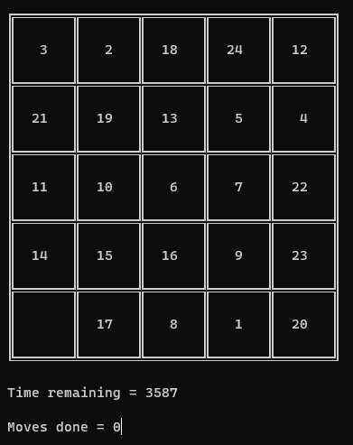

# Numbers Puzzle

Sliding numbers puzzle game in C, running on Windows cmd.exe.

This game was my midterm project for the **computer fundamentals and programming** university course, originally made in **late 2018**.

## Simple build & run

> Pro-tip: use an **IDE** to build and run the project; it will handle everything, probably.

### Ubuntu

> Tested on Ubuntu 22.04 LTS.

- `sudo apt install cmake gcc make libncurses-dev`
- `cmake . && make && ./PacXon`

Or

- `sudo apt install gcc libncurses-dev`
- `gcc main.c -lncurses && ./a.out`

### Other Operating Systems, including Windows

Figure it out :slightly_smiling_face:.